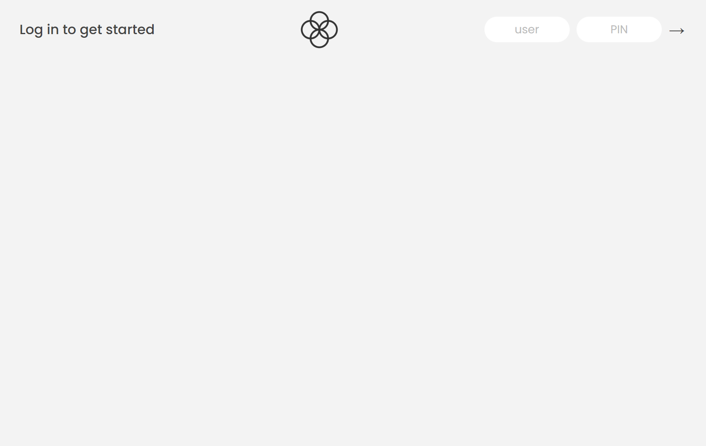
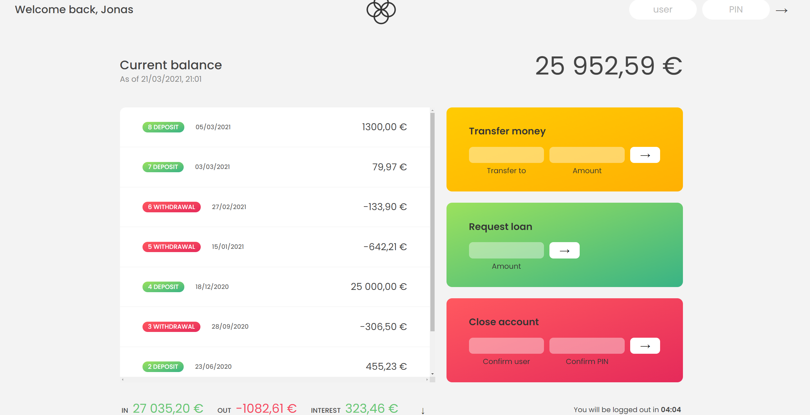

# Banking-Project

This is a simulated banking project that features some essential banking functions, including the ability of tracking down the movement activities, calculating the current balance, 
determining if the current user is able to transfer or loan a certain amount of money, deleting the account, and a timer has been set up for the auto-logout. There're two user accounts 
can be logged into the home page, Jonas Schmedtmann(js) and Eric Wei(ew), the passwords are 1111 and 2222 for each of them. The project is implemented by JavaScript, DOM and Intl 
APIs, HTML5 and CSS3 templates are given by the Udemy instructor, Jonas Schmedtmann.

### Login Page

### Main Page

### Flowchart

